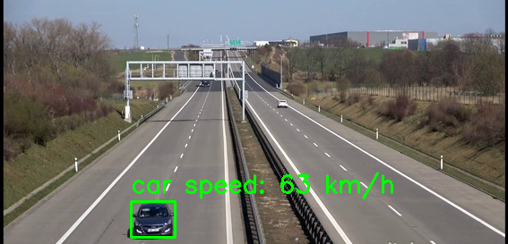

# Vehicle Collision Detection, Speed Tracking, and License Plate Recognition

This project utilizes **YOLO v11** and **OpenCV** in Python to detect vehicle collisions, track their speed, and recognize license plates from video footage. The system enables real-time monitoring and analysis of traffic activities, making it useful for accident prevention, law enforcement, and traffic management.

## 🚀 Features
- **Vehicle Detection**: Identifies vehicles on roads in real-time.
- **Collision Detection**: Detects potential vehicle collisions based on movement patterns.

- **Speed Tracking**: Estimates vehicle speed from video frames.

- **License Plate Recognition**: Detects and reads license plates using a trained YOLO v11 model.

## 🛠️ Tech Stack
- **YOLO v11** (Trained for vehicle and license plate detection)
- **OpenCV** (Image processing and real-time tracking)
- **Python** (Core programming language)

## 📂 Project Structure
